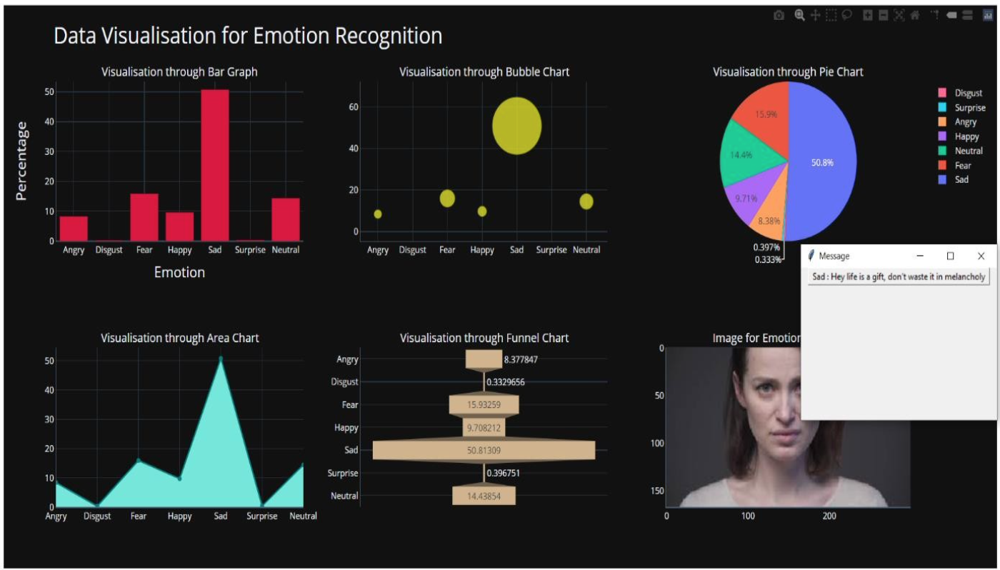

# RECOGNITION OF FACIAL EXPRESSION DATA USING BACKPROPAGATION ALGORITHM, VISUALIZATION OF IT USING PYTHON MODULES

## Introduction

The aim of Real-time Data Visualization of Facial Expression Data using Keras and Plotly is to detect and classify human facial expressions from image sequence this is also used to cope with emotional health problems caused due to our negativity in our day to day lives. This software uses biometric markers to detect emotions in human faces. The six expressions: happiness, sadness, anger, fear, surprise and neutral can be detected on the human face using this technology as it acts as a sentiment analysis tool. Emotional health plays a very important role to improve people’s quality of life, especially for the elderly. This kind of improvement might be considered great progress in this era of artificial intelligence. Facial expressions play a key role in our daily communications. Due to their outstanding recognition accuracy after training with large amounts of data, many deep learning approaches have been applied by various researchers in the past few years. This can be done basically in here steps: Firstly, Locating faces in the scene, in an image or video footage. Secondly, extracting information about facial features from detected faces and finally analyzing the movement of facial features or changes in the appearance of facial features and classifying this information into expression interpretative categories such as facial. It aims to improve one of the main issues that exist in our society, “Mental health”. Our project offers the feature of helping out the user by presenting them with a message when the program is executed and the result is a negative emotion or expression. An accuracy of 71.38% was achieved by training the FER2013 dataset using our proposed method. Keywords: Facial expressions, backpropagation algorithm, plotly, visualization, mental health.

## Conclusion

The project has a 80% accuracy in detection of human emotion correctly. Such a software has wide implications in building autonomous systems to interact with humans. They can help cover conversational based AI, which can change context and conversational tone after recognising human emotions. One main scope of improvement is having Real time- live streaming detection system using WebRTC or socket streaming. This too would allow vast implementation of this software. At the moment, we have implemented a 'Quote' system to respond to detected human emotion. This software also shows great promise in automated 'Psycho-therapy' sessions, or a tool to assist such sessions.
